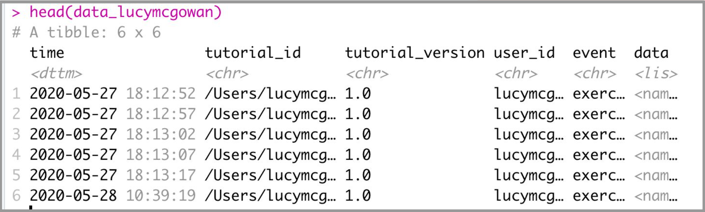

```{r setup, include=FALSE}
library(tidyverse)

library(knitr)
library(png)
library(rdrop2)
knitr::opts_chunk$set(echo = TRUE)
```

## Rough Draft

- Demographic data

- Assessment data

- Exercise data

### shiny + learnr + rdrop2 for data collection 

```{r figure1, eval=FALSE}
library(rdrop2)

# outside the shiny app
token <- drop_auth()
saveRDS(token, "droptoken.rds")

# inside the shiny app
drop_auth(rdstoken = "droptoken.rds")
```

### Function outline

```{r figure2, eval=FALSE}
event_recorder <- function(tutorial_id, tutorial_version, user_id, event, data) {
  
  # code goes here
  
  
  
}

options(tutorial.event_recorder = event_recorder)
```


### Filling in function


```{r figure2a, eval=FALSE}
event_recorder <- function(tutorial_id, tutorial_version, user_id, event, data) {
  
  if (drop_exists(glue("teaching-r-study/data_{user_id}.rds"))) {
    
    ...
    
    }
  
  else{
    
    ...
    
  }
  
  ...
  
  
  }

```

------------------------------------------------------------------------------------------

#### Part 1. 

```{r figure2b, eval=FALSE}
  ... {
    
    if (drop_exists(glue("teaching-r-study/data_{user_id}.rds"))) {
      
      # code goes here 
      
      }
    
    # code goes here
    
    
    else {
      ...
      }
    ...
    }
```


```{r figure2ba, eval=FALSE}
  ... {
    
    if (drop_exists(glue("teaching-r-study/data_{user_id}.rds"))) {
      
      drop_download(path = glue("teaching-r-study/data_{user_id}.rds"),
                    
                    local_path = glue("data_{user_id}.rds"),
                    
                    overwrite = TRUE) }
    
    # code goes here
    
    
    else {
      ...
      }
    ...
    }
```


```{r figure2bb, eval=FALSE}
  ... {
    if (drop_exists(glue("teaching-r-study/data_{user_id}.rds"))) {
      drop_download(path = glue("teaching-r-study/data_{user_id}.rds"),
                    local_path = glue("data_{user_id}.rds"),
                    overwrite = TRUE) }
    
    t <- readRDS(glue("data_{user_id}.rds"))
    
    
    else {
      ...
      }
    ...
    }
```


**data frame, t**

```{r  out.width = "25%", echo=FALSE}
include_graphics("images/figure4.png")

```

------------------------------------------------------------------------------------------


#### Part 2

```{r figure3, eval=FALSE}
  ... {
    if (drop_exists(glue("teaching-r-study/data_{user_id}.rds"))) {
      drop_download(path = glue("teaching-r-study/data_{user_id}.rds"),
                    local_path = glue("data_{user_id}.rds"),
                    overwrite = TRUE) }
    t <- readRDS(glue("data_{user_id}.rds"))
    
    
    else {
      
      # code goes here
      
    }
    
    ...
    }
```


```{r figure4, eval=FALSE}
... {
  ...
  
  else {
    t <- tibble(
      time = .POSIXct(numeric(0)),
      tutorial_id = character(),
      tutorial_version = character(),
      user_id = character(),
      event = character(),
      data = list())
  }
  
  ...
}
```

```{r  out.width = "25%", echo=FALSE}
include_graphics("images/figure4.png")

```

------------------------------------------------------------------------------------------

#### Part 3

```{r figure5, eval=FALSE}
... {
  if (drop_exists(glue("teaching-r-study/data_{user_id}.rds"))) {
    drop_download(path = glue("teaching-r-study/data_{user_id}.rds"),
                  local_path = glue("data_{user_id}.rds"),
                  overwrite = TRUE) }
  t <- readRDS(glue("data_{user_id}.rds"))
  
  else {t <- tibble(
    time = .POSIXct(numeric(0)),
    tutorial_id = character(),
    tutorial_version = character(),
    user_id = character(),
    event = character(),
    data = list())}
  
  
  # code goes here
  
  
}
```


```{r figure6, eval=FALSE}
... {
  
  ...
  
  t <- bind_rows(t, tibble(
    time = Sys.time(),
    tutorial_id = tutorial_id,
    tutorial_version = tutorial_version,
    user_id = user_id,
    event = event,
    data = list(data))
    )
  

}
```

```{r  out.width = "40%", echo=FALSE}
include_graphics("images/figure5.png")

```

```{r figure7, eval=FALSE}
... {
  
  ...
  
  t <- bind_rows(t, tibble(
    time = Sys.time(),
    tutorial_id = tutorial_id,
    tutorial_version = tutorial_version,
    user_id = user_id,
    event = event,
    data = list(data)))
  
  
  saveRDS(t, file = glue("data_{user_id}.rds"))
  drop_upload(file = glue("data_{user_id}.rds"),
              path = "teaching-r-study")
  
}
```

------------------------------------------------------------------------------------------

#### Putting it all together

```{r figure7a, eval=FALSE}
event_recorder <- function(tutorial_id, tutorial_version, user_id, event, data) {
  
  if (drop_exists(glue("teaching-r-study/data_{user_id}.rds"))) {
    drop_download(path = glue("teaching-r-study/data_{user_id}.rds"),
                  local_path = glue("data_{user_id}.rds"),
                  overwrite = TRUE) }
  
  t <- readRDS(glue("data_{user_id}.rds"))
  
  else {t <- tibble(
    time = .POSIXct(numeric(0)),
    tutorial_id = character(),
    tutorial_version = character(),
    user_id = character(),
    event = character(),
    data = list())}
  
  t <- bind_rows(t, tibble(
    time = Sys.time(),
    tutorial_id = tutorial_id,
    tutorial_version = tutorial_version,
    user_id = user_id,
    event = event,
    data = list(data)))
  
  saveRDS(t, file = glue("data_{user_id}.rds"))
  drop_upload(file = glue("data_{user_id}.rds"),
              path = "teaching-r-study")
  }
```


------------------------------------------------------------------------------------


```{r figure8, eval=FALSE}
question_is_correct.always_correct <- function(question, value, ...) { 
  return(mark_as(TRUE, message = NULL))
}
```


```{r figure9, eval=FALSE}
question("This is your question?",
         answer("This is an answer..", correct = TRUE),
         type = c("always_correct", "radio_button"),
         correct = "Submitted")
```


------------------------------------------------------------------------------------

## What we have so far

### sneak peak at what the current pilot looks like


```{r  out.width = "65%", echo=FALSE}


```


```{bash, eval=FALSE}
> data_lucymcgowan$data[[1]]

$label
[1] "vector"

$code
[1] "\n\nc(2,4,6,8)\n"

$output
<pre><code>[1] 2 4 6 8</code></pre>
<div class="alert alert-success" role="alert">Superb work! </div>
  
$error_message 
NULL

$checked
[1] TRUE
$feedback
```


```{bash, eval=FALSE}
> data_lucymcgowan$data[[1]]$feedback

$feedback$message
Superb work!
  
$feedback$correct
[1] TRUE

$feedback$type [1] 
"success"

$feedback$location [1] 
"append"
```


