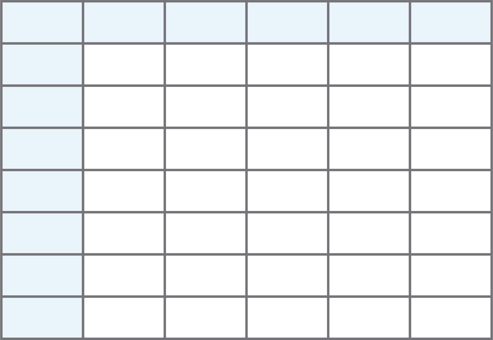

Collecting data using learnr
================

## Rough Draft

### shiny + learnr + rdrop2 for data collection

-----

Ideally all data collection can be completed on the same platform. This section describes how to collect demographic, assessment, and exercise data from shiny and store it for future analysis. 

The three main tools that permit automatic and continuous data
collection are **Shiny**, the **rdrop2** package, which allows for integration with Dropbox, and the **learnr** package in R.  **Shiny** provides the overall platform, the integration with Dropbox allows the user to
continuously collect and store participant data, and **learnr** allows the participant to input responses. 

#### Dropbox integration

In order to continuously save data on Dropbox, the user needs:
1. A Dropbox account
2. A _token_ to allow access to this account from R

Outside of the shiny app, we create a token for the authentications and
save it as an .RDS file (Code 1). This process allows the application to communicate
with Dropbox. In the app itself, we then reference the token (Code 2). Once authenticated, we can tie into learnr to pull data
from each particpant’s interactions: clicks, completions, skips, attempts,
results, etc.

The following code outlines how to create and d
``` r
library(rdrop2)

token <- drop_auth()
saveRDS(token, "droptoken.rds")
```
**Code 1.** Creating a Dropbox token. This code is run _outside_ the Shiny application. 

```r
library(rdrop2)

# inside the shiny app
drop_auth(rdstoken = "droptoken.rds")
```
**Code 2.** Referencing a Dropbox token to authenticate a user. This code is run once _inside_ the Shiny application. 

#### Recording responses with learnr

In order to save participant inputs, we need to set an _event recorder_. Code 3 outlines a function that can be used to record every participant interaction in the application. The function has
five inputs: the tutorial id, tutorial version, user id, event, and
data. For any given participant, the user id, events, and data will be unique.
Hence, each participant classifies under a unique identifier, completes
exclusive events (completing an exercise, skipping a section, answering
a demographic survey, etc.), and links to an individual data that lists
each event results. We then set the tutorial
event recorder by specifying the created function in the `options` (Code 4).

``` r
event_recorder <- function(tutorial_id, 
                           tutorial_version,
                           user_id,
                           event, 
                           data)
  {
  
  ...
  
  }

options(tutorial.event_recorder = event_recorder)
```
**Code 4**. Code scaffolding for including an event recorder.


``` r
event_recorder <- function(tutorial_id, tutorial_version, user_id, event, data) {
  
  if (drop_exists(glue("teaching-r-study/data_{user_id}.rds"))) {
    
    ...
    
    }
  
  else{
    
    ...
    
  }
  
  ...
  
  
  }
```

-----

The first piece defines the ‘if’ statement; this is where the function
searches dropbox for existing user data.

``` r
  ... {
    
    if (drop_exists(glue("teaching-r-study/data_{user_id}.rds"))) {
      
      # code goes here
      
    }
    
    # code goes here
    
    ...
    
    }
```

Throughout the task, we use the glue package to tie together strings.
The glue package instructs this piece of code, in a single command, to
search the indicated dropbox folder for prior data under the user’s
unique id. If there’s data, then the function proceeds to download that
data to the indicated path; and override it to the indicated path.

``` r
  ... {
    
    if (drop_exists(glue("teaching-r-study/data_{user_id}.rds"))) {
      
      drop_download(path = glue("teaching-r-study/data_{user_id}.rds"),
                    
                    local_path = glue("data_{user_id}.rds"),
                    
                    overwrite = TRUE) }
    
    # code goes here
```

Lastly, the rds file reads into a local data frame called t. We use the
glue package to link the data to the user id, hence, ensuring the
dataset remains unique for each student.

``` r
... {
    if (drop_exists(glue("teaching-r-study/data_{user_id}.rds"))) {
      drop_download(path = glue("teaching-r-study/data_{user_id}.rds"),
                    local_path = glue("data_{user_id}.rds"),
                    overwrite = TRUE) }
    
    t <- readRDS(glue("data_{user_id}.rds"))
    
    ...
    
  }
```

**data frame, t**



-----

Next, we define the else statement, which provides alternative commands
when data doesn’t exist in the dropbox. When there’s no data to
download, the function creates an empty data frame called t. The data
set is unique to the user, and it accepts six inputs: current time,
tutorial id, tutorial version, user id, event, and data.

``` r
... {
  ...
  
  else {
    t <- tibble(
      time = .POSIXct(numeric(0)),
      tutorial_id = character(),
      tutorial_version = character(),
      user_id = character(),
      event = character(),
      data = list())
  }
  
  ...
}
```


-----

Consequently, defining the if-else part pulls in the data frame t that
either includes a former user’s old data frame or creates a new user’s
empty data frame. We define a mechanism to bind the rows of the data
frame, which takes the original data frame and adds an extra row.

``` r
... {
  if (drop_exists(glue("teaching-r-study/data_{user_id}.rds"))) {
    drop_download(path = glue("teaching-r-study/data_{user_id}.rds"),
                  local_path = glue("data_{user_id}.rds"),
                  overwrite = TRUE) }
  t <- readRDS(glue("data_{user_id}.rds"))
  
  else {t <- tibble(
    time = .POSIXct(numeric(0)),
    tutorial_id = character(),
    tutorial_version = character(),
    user_id = character(),
    event = character(),
    data = list())}
  
  t <- bind_rows(t, tibble(
    time = Sys.time(),
    tutorial_id = tutorial_id,
    tutorial_version = tutorial_version,
    user_id = user_id,
    event = event,
    data = list(data))
    )
  
}
```


Lastly, we instruct the code to save the RDS so that, whenever a user
interacts with the tutorial, the function automatically appends a new
row to the user’s data frame. This process documents constant updates to
the data frame and uploads it back onto dropbox.

``` r
... {
  ...
  
  saveRDS(t, file = glue("data_{user_id}.rds"))
  drop_upload(file = glue("data_{user_id}.rds"),
              path = "teaching-r-study")
  }
```

-----

#### Putting it all together

``` r
event_recorder <- function(tutorial_id, tutorial_version, user_id, event, data) {
  
  if (drop_exists(glue("teaching-r-study/data_{user_id}.rds"))) {
    drop_download(path = glue("teaching-r-study/data_{user_id}.rds"),
                  local_path = glue("data_{user_id}.rds"),
                  overwrite = TRUE) }
  
  t <- readRDS(glue("data_{user_id}.rds"))
  
  else {t <- tibble(
    time = .POSIXct(numeric(0)),
    tutorial_id = character(),
    tutorial_version = character(),
    user_id = character(),
    event = character(),
    data = list())}
  
  t <- bind_rows(t, tibble(
    time = Sys.time(),
    tutorial_id = tutorial_id,
    tutorial_version = tutorial_version,
    user_id = user_id,
    event = event,
    data = list(data)))
  
  saveRDS(t, file = glue("data_{user_id}.rds"))
  drop_upload(file = glue("data_{user_id}.rds"),
              path = "teaching-r-study")
}
```

-----

Now, we look into the deployment of questions. By default, the learnr
module writes questions with correct answers and provides instant
feedback that unveils the solution. However, this study uses assessments
that aren’t supposed to give away solutions immediately. To change the
module’s default, we create a new class of a keyword in the r space that
marks every answer as correct, so the user can’t see the right answer.
Since the module requires some solution that’s correct, we set the
question type to always correct. Regardless of whether answered
correctly, the user will get the right answer, letting them know they
completed their submission and can move on.

``` r
question_is_correct.always_correct <- function(question, value, ...) {
  return(mark_as(TRUE, message = NULL))
}
```

``` r
question("This is your question?",
         answer("This is an answer..", correct = TRUE),
         type = c("always_correct", "radio_button"),
         correct = "Submitted")
```

-----

Now, we have a sneak peek at what the data will look like when going
through the tutorial. There’s a column for each of the function inputs:
current time, tutorial id, tutorial version, user id, event, and data.

The data, a different list for each user event, holds the most critical
information for analyzing results. We can organize and sift through the
copious amounts of data by using the tidycode and Matahari packages;
these packages provide a way to capture and analyze the code in the
tutorial.


First, check the data’s labels, which path a particular event where the
information recording occurs. To ease the organization, we can change
indiscernible filenames to be more legible. Next, check the data’s code
to see exactly what the user inputs into an event. Then, check the
data’s output that reveals what the user sees in the tutorial. Now,
check the data’s error messages to look at all reports of user mistakes.
Next, check the data’s marks to verify the completion of tasks. Lastly,
check the data’s feedback to view what the user observes for completing
a given event.

``` bash
> data_lucymcgowan$data[[1]]

$label
[1] "vector"

$code
[1] "\n\nc(2,4,6,8)\n"

$output
<pre><code>[1] 2 4 6 8</code></pre>
<div class="alert alert-success" role="alert">Superb work! </div>
  
$error_message 
NULL

$checked
[1] TRUE

$feedback
```

As for questions checking for accuracy, the data’s feedback also
displays whether a user got the event right. This data snapshot collects
in the background of the shiny app, and then automatically sends any
update or change to dropbox.

``` bash
> data_lucymcgowan$data[[1]]$feedback

$feedback$message
Superb work!
  
$feedback$correct
[1] TRUE

$feedback$type [1] 
"success"

$feedback$location [1] 
"append"
```

-----

In conclusion, this study emphasizes the simplicity of using R Shiny,
rdrop2, and learner packages to deploy a discrete method for collecting
user participation data. By providing access to all user attempts,
operations, clicks, skips, errors, time, etc. in a tutorial, R furthers
valuable data collection, leading to vital analysis for answering
complex questions.

<div id="refs" class="references hanging-indent">

<div id="ref-Lucymcgowan/Talks">

McGowan, Lucy D’Agostino. 2020. “Best Practices for Teaching R a
Randomized Controlled Trial.” Presentation. *Lucymcgowan.com/Talks*.
[ocs.google.com/presentation/d/1kOtqXMWhNE6OjInt32PnkBC\_j\_GfVQ-rJKzFxOn29yM/edit?usp=sharing](ocs.google.com/presentation/d/1kOtqXMWhNE6OjInt32PnkBC_j_GfVQ-rJKzFxOn29yM/edit?usp=sharing).

</div>

</div>
