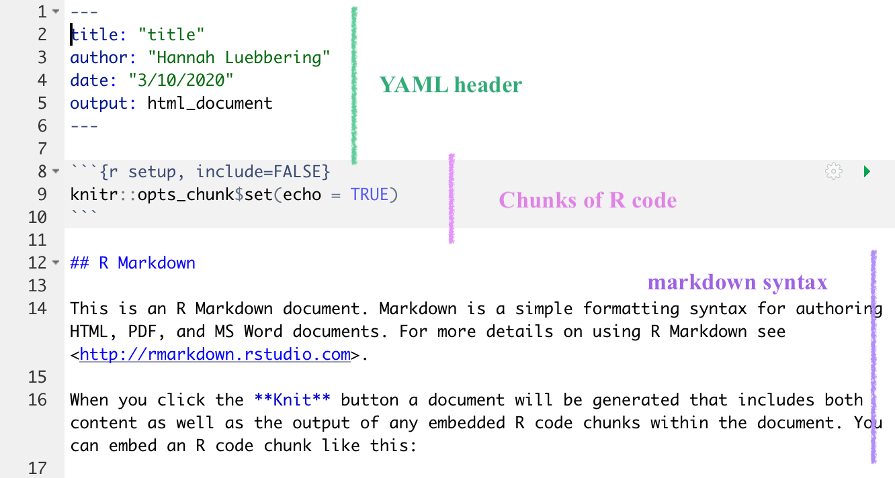
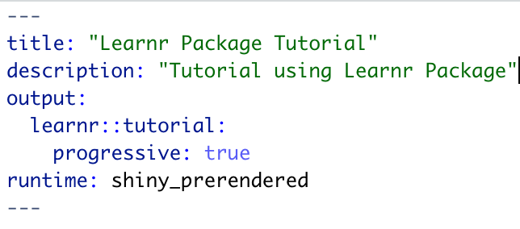
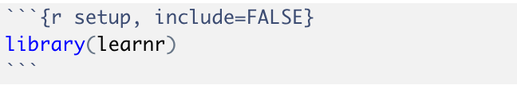
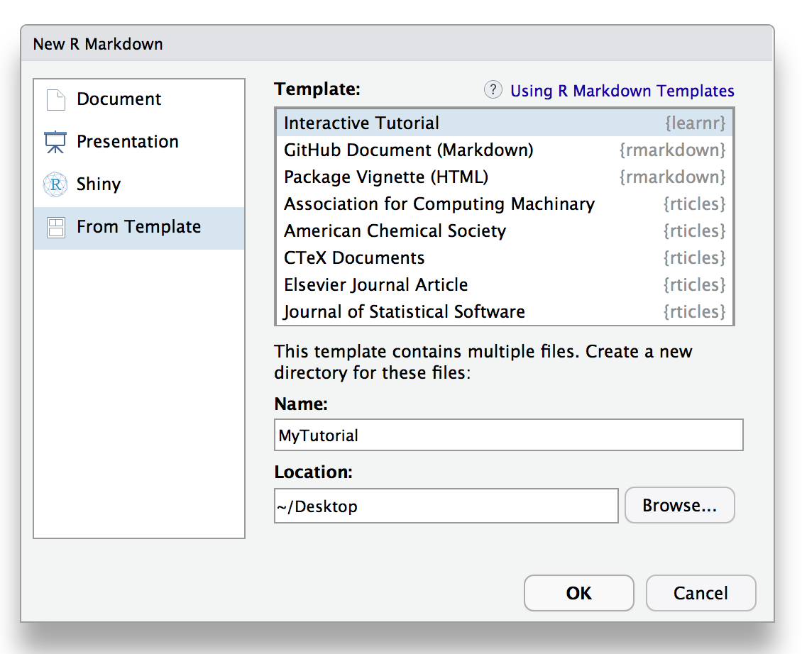

```{r setup, include=FALSE}
library(learnr)
library(tibble)
library(jsonlite)
```


## <span style="color: magenta;">Learnr Package Overview</span>

***

#### **The <span style="color: teal;">Learnr Package</span> helps us transform an R Markdown document into an interactive tutorial**


- Tutorials made with the learnr package consist of content and **interactive components** that

  - provide systematized learning 
    
  - teach users how to do data analysis using packages such as tidyverse
    

- In our tutorial we can include...
  - figures 
  - equations 
  - code exercises 
  - quiz questions 
  - videos
  - and other interactive components 

***

> #### Introduction to <span style="color: teal;">R MarkDown</span>:
<span style="color: purple;">Three Basic Types of Information:</span>

1. the YAML header at the very top

2. Chunks of r code separated by ```

3. Text written using markdown syntax 

    { width=50% }

***


> #### The <span style="color: teal;">learnr::tutorial</span> 
<span style="color: purple;">An R Markdown with three extra elements:</span>


1. Loads the learnr package

2. Uses the runtime: shiny_prerendered directive in the YAML header

3. Provides a description in the YAML header

    a. More information found at https://rstudio.github.io/learnr/formats.html

    { width=50% }
    { width=50% }


## <span style="color: magenta;">Getting Started</span>


***
<span style="color: teal;">**Install the learnr package in R Console as shown below:**</span>

```{r example1, eval=FALSE}
install.packages("learnr")
```

***

<span style="color: teal;">**Create a Tutorial**</span>

1. Start a new project/ directory in RStudio

2. In the new directory, add a <span style="color: blue;">R Markdown</span> document by going to file and selecting add new file

3. Create a new <span style="color: blue;">learnr::tutorial</span> document from a <span style="color: blue;">template</span> (through the New R Markdown dialog)
    - learnr::tutorial format provides default layout included with the learnr package

    { width=50% }   

4. Title your Project in the <span style="color: blue;">YAML</span> metadata header as shown below:

```{r example, eval=FALSE}

---
title: "Tutorial Practice using Learnr"
output: learnr::tutorial
runtime: shiny_prerendered
--- 

```
  *This is what a standard YAML header looks like*

5. <span style="color: blue;">Setup</span> the document by loading learnr package as shown below:

````markdown
`r ''````{r setup, include=FALSE}
library(learnr)
```
````

## <span style="color: magenta;">Code Chunks</span> 

<span style="color: teal;">**R Code Chunks...**</span>


* are stable identifiers in relation to each interactive component

* contain exercises or quiz questions 

* must have a unique chunk label 

* must start and end with verbatims
  - verbatims: ` ``` `

******

#### <span style="color: red;">**IMPORTANT**</span> 

**Each Chunk** of R-Code must

start with ` ``` ` 

and end with ` ``` ` 

Or indent by four spaces:

    This text is displayed verbatim / preformatted
    
******
<span style="color: teal;">**Format Example**</span>

````markdown
`r ''````{r chunk-name, exercise=TRUE}
  #  code goes here
  #  
  #  
  #  
```
````

```{r print-limit, exercise=TRUE}
#  code goes here
#  
#  
#     
```

******

```{r intro-option3, eval = FALSE}
# this is a comment which is not processed by R
# comments will appear on output document like this
```

***

<span style="color: teal;">**A Few Common Chunk Options:**</span>

- `eval`: Set equal to True or False. Decides whether to evaluate a code chunk or not.

- `echo`: Set equal to True or False. Decides whether to show the source code in the output document or not.

- `results`: If set to 'hide', the results will be hidden from the output document, but the chunk will still be evaluated.

- `exercise`: Usually set equal to True so that the chunk outcome/results are visible in the output document. 

- `exercise.eval`: Usually set equal to True so that the chunk outcome/results are visible in the output document. 

***
  
More information found at:            
https://rmarkdown.rstudio.com/articles_verbatim.html                           
https://yihui.name/knitr/options

******

## <span style="color: magenta;">Text Format</span> 

***
<span style="color: teal;">**MARKDOWN SYNTAX**</span>

INPUT                          | OUTPUT
------------------------------ | ------------------------------
``1.Plain text``               | 1.Plain text
``2.*italics* and _italics_``  | 2. *italics* and _italics_
``3.**bold** and __bold__``    | 3.**bold** and __bold__
``4.superscript^2^``           | 4.superscript^2^
``5.~~strikethrough~~``        | 5.~~strikethrough~~

*********
<span style="color: teal;">**FONT COLOR**</span>

OUTPUT                                           | INPUT
------------------------------------------------ | ----------------------------------------------
<span style="color: magenta;">magenta</span>     | ``<span style="color: magenta;">magenta</span>``
<span style="color: pink;">pink</span>           | ``<span style="color: pink;">pink</span>``
<span style="color: green;">green</span>         | ``<span style="color: green;">green</span>``
<span style="color: teal;">teal</span>           | ``<span style="color: teal;">teal</span>``
<span style="color: blue;">blue</span>           | ``<span style="color: blue;">blue</span>``
<span style="color: purple;">purple</span>       | ``<span style="color: purple;">purple</span>``
<span style="color: yellow;">yellow</span>       | ``<span style="color: yellow;">yellow</span>``
<span style="color: orange;">orange</span>       | ``<span style="color: orange;">orange</span>``
<span style="color: red;">red</span>             | ``<span style="color: red;">red</span>``


******
> More information found at https://bookdown.org/yihui/rmarkdown/markdown-syntax.html

## <span style="color: magenta;">Datasets and Plots</span> 

<span style="color: teal;">**DataSet**</span> 

We can add DataSets as follows:
````markdown
`r ''````{r cars}
  mtcars(cars)
```
````

```{r cars, echo=FALSE}
mtcars
```

<span style="color: teal;">**Summary of DataSet**</span> 

````markdown
`r ''````{r cars}
  summary(cars)
```
````

```{r cars2, echo=FALSE}
summary(cars)
```

***

<span style="color: teal;">**Plot**</span> 

We can add Plots as follows:

````markdown
`r ''````{r}
plot(cars)
```
````

```{r cars1, echo=FALSE}
plot(cars)
```


***
<span style="color: teal;">**Equations**</span> 

$f(k) = {n \choose k} p^{k} (1-p)^{n-k}$

```{r}
x = 5  # radius of a circle
```

For a circle with the radius `r x`,
its area is `r pi * x^2`.


## <span style="color: magenta;">Exercises</span> 

<span style="color: teal;">**Exercises-- interactive R code chunks that...**</span> 

- allow users to work with R code and see results

- can include hints, solutions, and/or feedback 

****

<span style="color: teal;">**Create an Exercise:**</span>

##### <span style="color: purple;">Code Input</span>
````markdown
`r ''````{r exercise-example, exercise=TRUE, exercise.eval=TRUE}
  # Code goes here
  
   
   
```
````

##### <span style="color: purple;">User Output</span> 
```{r exercise-example, exercise=TRUE, exercise.eval=TRUE}

```

  - **empty code chunk provided for entering the answer**
  - exercise pre-evaulated using `exercise.eval` option so that the user can see the output they are manipulating

******

> <span style="color: teal;">**Here are a few simple exercises:**</span> 


1. **Write R code that adds two plus two:**

```{r two-plus-two, exercise=TRUE}

```

***

2. **Write a function that adds two numbers:**

  - *exercise with pre-existing code + initial room to work.*

```{r add-function, exercise=TRUE, exercise.lines = 5}
add <- function() {
  
}
```

***

3. **Modify code to reduce number of rows printed from `pressure` dataset:**

```{r print-limit3, exercise=TRUE, exercise.eval=TRUE}
pressure
```

```{r print-limit3-hint}
head(pressure)

```

***

4. **Modify code to plot `pressure` from number 3: **

```{r print-limit4, exercise=TRUE, exercise.eval=TRUE}
pressure
```

```{r print-limit4-solution}
plot(pressure)
```


## <span style="color: magenta;">Questions</span> 

<span style="color: teal;">**Questions-- interactive R code chunks that...**</span> 

- produce multiple-choice quiz questions with single or multiple correct answers

****

<span style="color: teal;">**Create a Question:**</span>

##### <span style="color: purple;">Code Input</span>
````markdown
`r ''````{r question-example}
  question("Question Goes Here",
  answer("a"),
  answer("b"),
  answer("c", correct = TRUE)
)
   
```
````

##### <span style="color: purple;">Output</span> 
```{r quest, echo=FALSE}
question("Question Goes Here",
  answer("a"),
  answer("b"),
  answer("c", correct = TRUE)
)

```

 
******

> <span style="color: teal;">**Here are a few Examples:**</span> 

1. **Call question() function within R code chunk**

```{r planent-earth}
question("What planet are we currently on?",
  answer("Mars"),
  answer("Saturn"),
  answer("Earth", correct = TRUE),
  answer("Jupiter")
)
```


2. **Call quiz() and question() functions within R code chunk**

```{r quiz}
quiz(
  question("Which function installs the learnr package from CRAN?",
    answer("library()"),
    answer("tools()"),
    answer("install.packages()", correct = TRUE),
    answer("run()")
  ),
  question("A tutorial uses the runtime: ______ directive in the ______.  (select 2 answers)",
    answer("shiny_prerendered", correct = TRUE),
    answer("knitr"),
    answer("code chunks"),
    answer("YAML header", correct = TRUE)
  )
)
```


## <span style="color: magenta;">Videos</span> 

<span style="color: teal;">**Add a Video:**</span>

##### <span style="color: purple;">Code Input</span>

`{width="560" height="315"}`

##### <span style="color: purple;">Output</span>

{width="560" height="315"}

              


`{width="560" height="315"}`
{width="560" height="315"}


`{width="560" height="315"}`
{width="560" height="315"}


`{width="560" height="315"}`
{width="560" height="315"}


## <span style="color: magenta;">Shiny Components</span> 

***

<span style="color: teal;">Looking back to the **YAML setup**,</span>                     

- we see the execution of the document declares `runtime: shiny_prerendered`

<span style="color: teal;">As a result, we have **interactive documents** that are,</span>                     

- `prerendered` 

- and, consequently, `quick to execute`

***

>Prerendered refers to user interface, data, and other large documents being translated, condensed, and executed ahead of time -before running the program-

***

<span style="color: teal;">**Example:**</span> 

```{r, echo=FALSE}
sliderInput("bins", "Number of bins:", min = 1, max = 50, value = 30)
plotOutput("distPlot")
```

```{r, context="server"}
output$distPlot <- renderPlot({
  x <- faithful[, 2]  # Old Faithful Geyser data
  bins <- seq(min(x), max(x), length.out = input$bins + 1)
  hist(x, breaks = bins, col = 'darkgray', border = 'white')
})
```

***

More information at https://rmarkdown.rstudio.com/authoring_shiny_prerendered.html
